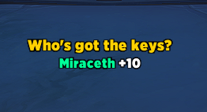

# Who's Got The Keys?

Simple addon for World of Warcraft that shows who has a key
for the current Mythic+ dungeon before you start.

[BigWigs](https://www.curseforge.com/wow/addons/bigwigs) has
this functionality built in, but I wanted it in a stand-alone
mod.

You can move the frame and change the font via edit mode.

## Installation

1. Download or clone this repository.
2. Copy the `WhoseGotTheKeys` folder into your WoW `_retail_/Interface/AddOns/` directory.
3. Reload the UI (`/reload`).

## Provenance

This project was primarily created with an LLM, but with a strong guiding
hand. It's not "vibe coded", but an LLM was still the primary author of most
lines of code. I believe it meets the same sort of standards I'd aim for with
hand-crafted code, but some slop may slip through. I understand if you
prefer not to use LLM-created software, and welcome human-authored alternatives
(I just don't personally have the time/motivation to do so).
